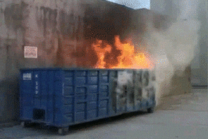

# operator-dumpster

[](https://github.com/afritzler/operator-dumpster/actions/workflows/test.yml)
[](https://makeapullrequest.com)
[](LICENSE)



---
## Overview

`operator-dumpster` is a collection of Kubernetes operators of questionable quality and use-case. This project is used
to evaluate new kubebuilder/controller-runtime features and CI/CD methods.

## Installation, Usage and Development

operator-dumpster is a [kubebuilder](https://github.com/kubernetes-sigs/kubebuilder) project.
The API definitions can be found at [apis](apis).

The project also comes with a well-defined [Makefile](Makefile).
The CRDs can be deployed using

```shell
make install
```

To run the controllers locally, just run

```shell
make run
```

To deploy the controllers into the currently selected (determined by your current kubeconfig) cluster,
just run

```shell
make deploy
```

This will apply the [default kustomization)[config/default] with correct RBAC permissions.


## Contributing

We'd love to get feedback from you. Please report bugs, suggestions or post questions by opening a GitHub issue.

## License

[Apache-2.0](LICENSE)